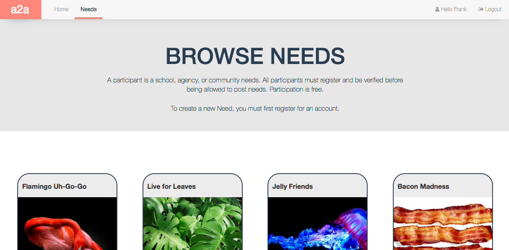

# _a2a_

#### _a microlending app to help donors to contribute directly to their community needs}, {April, 2017_

#### By the team at **[Flight](https://flight.run/)**

## Setup/Installation Requirements

Download this repo using your terminal: git clone https://github.com/Methodician/a2a.git

    cd a2a

View the code by drag-and-dropping the file into your [favorite text editor](https://atom.io)

Build the project locally by typing:

    npm install

    ng serve

aid2assist.com should now be running locally on [port 4200.](localhost:4200)

## Known Bugs

_There are no known bugs as of the last commit. Please send an ISSUE on github in the repository if you see something we have not._

## Contact for hire

Do you want to talk to Flight about building something for you?, please email [us here:](<info.flight.run@gmail.com>)

## Technologies Used

* Angular 2
* CSS3
* TypeScript
* Firebase

# a2a instructions from the Angular CLI:

This project was generated with [angular-cli](https://github.com/angular/angular-cli) version 1.0.0-beta.20-4.

## Development server
Run `ng serve` for a dev server. Navigate to `http://localhost:4200/`. The app will automatically reload if you change any of the source files.

## Code scaffolding

Run `ng generate component component-name` to generate a new component. You can also use `ng generate directive/pipe/service/class`.

## Build

Run `ng build` to build the project. The build artifacts will be stored in the `dist/` directory. Use the `-prod` flag for a production build.

## Running unit tests

Run `ng test` to execute the unit tests via [Karma](https://karma-runner.github.io).

## Running end-to-end tests

Run `ng e2e` to execute the end-to-end tests via [Protractor](http://www.protractortest.org/).
Before running the tests make sure you are serving the app via `ng serve`.

## Deploying to Github Pages

Run `ng github-pages:deploy` to deploy to Github Pages.

## Further help

To get more help on the `angular-cli` use `ng --help` or go check out the [Angular-CLI README](https://github.com/angular/angular-cli/blob/master/README.md).
